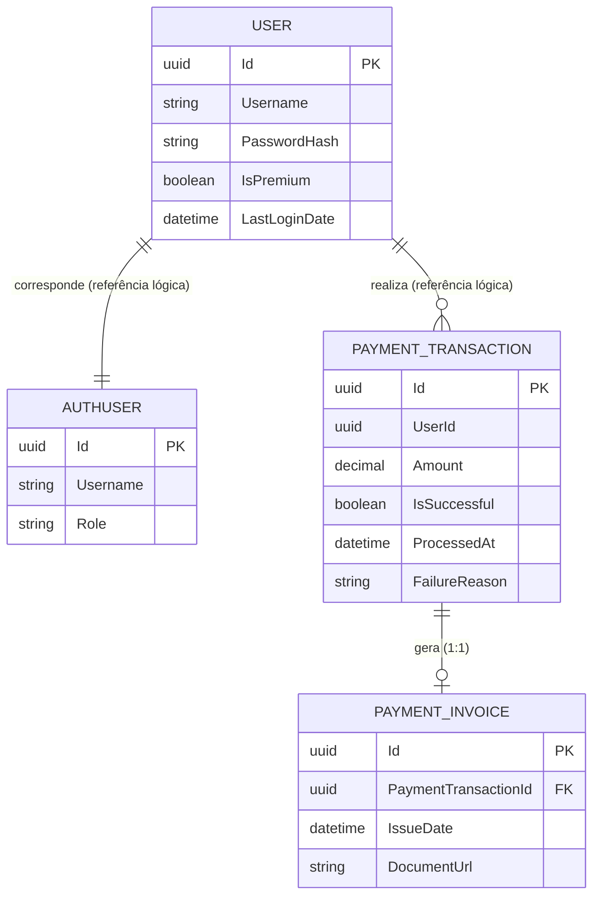

# 🚀 Microservices Learning

Uma aplicação .NET 7 construída para estudo de Microsserviços, implementando sistemas distribuídos com API Composition, Event-Driven Architecture, Domain-Driven Design (DDD), API Gateway e mensageria, utilizando as seguintes tecnologias: RabbitMQ, MassTransit, Entity Framework Core e OpenTelemetry.

## 🧩 O que o projeto faz?

- 5 APIs pequenas simulando um e-commerce:

1. **Gateway**: Gateway dos microserviços, podendo ser comunicado diretamente com frontend caso haver necessidade.
2. **User**: Cuida do cadastro dos clientes.
3. **Auth**: Cuida do Login e de gerar os Tokens (JWT).
4. **Payment**: Processa pagamentos e gera faturas.
5. **Notification**: Escuta os outros serviços para notificações, simula envio de e-mails.

## 🛠️ Tecnologias Utilizadas

- **Back-end:** C# .NET 7, Minimal APIs, Entity Framework Core
- **Banco de Dados:** PostgreSQL (Banco isolado para cada microsserviço)
- **Mensageria:** RabbitMQ & MassTransit
- **Resiliência & API Gateway:** YARP (Reverse Proxy) & Polly
- **Observabilidade:** OpenTelemetry & Zipkin
- **Infraestrutura:** Docker & Docker Compose

## 🗄️ Diagrama Entidade-Relacionamento (DER)



## 📍 Mapeamento dos Endpoints

### GatewayService
- `GET /api/system/overview`: Retorna informações básicas de saúde de todos os microsserviços.
- `GET /api/reports/system-stats`: **API Composition** - Faz 5 chamadas HTTP simultâneas para agregar e retornar os dados de Usuários, Vendas, Faturas, Segurança e Notificações em um único JSON.

### UserService
- `POST /users`: Cria um novo usuário e publica o evento na fila.
- `GET /users/stats`: Retorna quantidade de usuários (comum e VIP).
- `GET /users/info`: Retorna status da API.

### AuthService
- `POST /auth/login`: Valida usuário, gera Token JWT e publica evento de login.
- `GET /auth/stats`: Retorna logs e relatórios de segurança.
- `GET /auth/info`: Retorna status da API.

### PaymentService
- `POST /payments/process`: Valida JWT, aplica DDD, processa o pagamento, gera a Fatura e avisa a fila se deu Sucesso ou Falha.
- `GET /payments/{userId}/invoices`: Retorna a lista de faturas do usuário cruzando com suas transações.
- `GET /payments/invoices`: Retorna todas as faturas geradas.
- `GET /payments/stats`: Retorna relatório de transações e valores arrecadados.
- `GET /payments/info`: Retorna status da API.

### NotificationService (Consumidor Passivo)
- `GET /notifications/stats`: Retorna o contador em memória de quantos e-mails simulados de Boas-Vindas, Segurança ou Falhas já foram enviados hoje.
- `GET /notifications/info`: Retorna status da API.

---

## 🚀 Como testar na sua máquina

Basta ter o Docker instalado!

1. Clone o projeto e abra o terminal.
2. Suba tudo com 1 comando mágico:
   ```bash
   docker-compose up -d --build
   ```
3. Rode as tabelas no banco de dados:
   ```bash
   cd UserService && dotnet ef database update
   cd ../AuthService && dotnet ef database update
   cd ../PaymentService && dotnet ef database update
   ```
4. Pronto! O projeto de estudos está rodando:
   - **Ver as Estatísticas no Gateway:** `http://localhost:8080/api/reports/system-stats`
   - **Ver o Rastreamento (Zipkin):** `http://localhost:9411`
